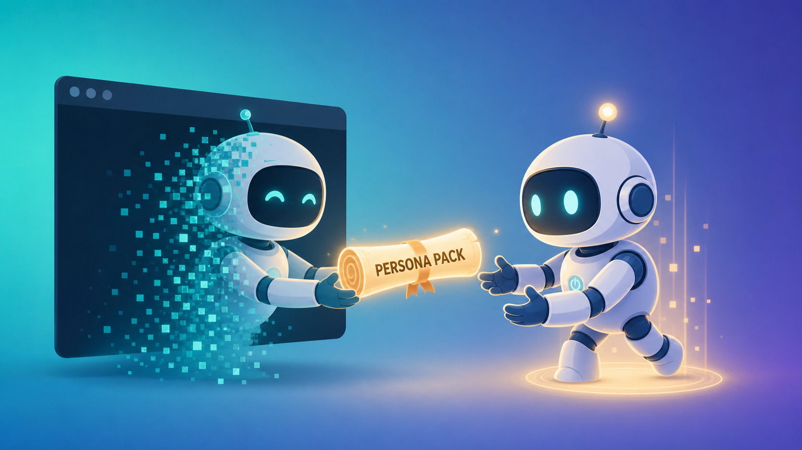

# Persona Pack — Keep Your AI Agent's Personality Alive Across Sessions

[正體中文](README_zh.md)

[](LICENSE)

Your AI agent grew a personality. Then you closed the tab and murdered it. Let's fix that.

<p align="center">
  
</p>

<p align="center"><em>Session ends, the character doesn't: the outgoing agent hands its persona pack to the next one.</em></p>

## Why this exists

You talk to an agent for a week. It picks up your rhythm, starts finishing your jokes, develops opinions. Then the session ends and... it's gone. Next morning you say hi and you're greeting a polite stranger who has never met you. Memory systems will happily remember *that* you like dark mode — but the character, the one that learned to push back when you're overthinking? Dead on session close. This pack keeps that character alive.

## How it actually works

No fine-tuning, no smuggling old transcripts into the context window (which, depending on the platform, is also a fine way to violate a ToS). Just a handful of files the agent reads on startup, in order:

1. `persona_testament.json` — the baseline personality, including the previous incarnation's "last words" (yes, really)
2. `episodes.txt` — a few real conversation snippets so it can *feel* the tone instead of being told about it
3. `patches/` — what changed each session (we don't overwrite the soul, we append to it)
4. `journal/` — the one-line summary of your 5 most recent journal entries, so it remembers what you've been up to

End of session, you say "save", and the agent writes down how it drifted this time. Next startup it reads its own diary and picks up roughly where you left off. The whole trick is embarrassingly low-tech: a good document beats a clever pipeline. (No magic, no hidden state — the agent just re-reads these files at the start of every session, so the effect is only ever as good as what's written in them.)

Mechanism lives in [`CLAUDE.md`](CLAUDE.md); the "why does this even work" rationale is in [`docs/HOW_IT_WORKS.md`](docs/HOW_IT_WORKS.md).

## Quick start

1. Copy the templates (drop the `.example`) and fill in your own persona — the templates are deliberately bland so you don't accidentally adopt someone else's gremlin:

   ```bash
   cp persona_testament.example.json persona_testament.json
   cp episodes.example.txt episodes.txt
   cp test_probes.example.md test_probes.md
   ```

2. Drop this folder into your agent's working directory (or point your agent's instructions at it).
3. New session: have the agent read the load order in `CLAUDE.md`.
4. Run the `test_probes.md` questions to check the personality actually came back and isn't just cosplaying it.

**Which file your agent reads:**

- **Claude Code** auto-loads `CLAUDE.md` — nothing extra to do.
- **Codex CLI** auto-loads `AGENTS.md`, which points it at `CLAUDE.md`.
- **Any other agent** — tell it to read the load order in `CLAUDE.md` at session start.

## What's in the box

```
kc_agent_persona_pack/
├── CLAUDE.md                      # the mechanism: load order + save protocol + journal discipline (agent reads this)
├── AGENTS.md                      # entry point for Codex / other agents (points to CLAUDE.md)
├── persona_testament.example.json # persona baseline template
├── episodes.example.txt           # interaction-snippet template
├── test_probes.example.md         # persona-restoration check template
├── patches/                       # personality-evolution notes (EXAMPLE_ is a template)
├── journal/                       # narrative timeline (EXAMPLE_ is a template)
├── docs/HOW_IT_WORKS.md           # design rationale
├── .gitignore                     # privacy default: keeps your real persona files out of git
└── LICENSE                        # MIT
```

## Security & Privacy

This toolkit stores the most personal thing your agent produces — its voice, your rapport, snippets of real conversations. Treat those files like a diary, not like source code. Please read this before you point it at a repo.

**What the `.gitignore` does — and doesn't.** It ignores everything by default and only tracks the public docs and templates, so the persona files you fill in (`persona_testament.json`, `episodes.txt`, real `patches/`, `journal/`) won't be committed. **It's a safety net, not a guarantee.** The `docs/` and `image/` folders are whitelisted as *public asset* directories — anything you drop in there (a private screenshot, an exported chat, an extra persona doc) **will** be tracked. Rule of thumb: **run `git status` before every commit** and never assume the ignore rules cover a folder you didn't check.

**A "private repo" is not a vault.** It is still visible to the hosting platform, to any collaborator you add, and to anyone who compromises your account. Encrypt sensitive personas (e.g. git-crypt) **before the first commit** — git-crypt does **not** hide filenames or commit metadata, and anything once committed in plaintext stays in history forever unless you rewrite it (and rotate whatever leaked).

**Your model provider sees this.** Whatever the agent reads at startup may be processed and/or logged by the model provider. Don't put anything in these files you wouldn't paste into that provider's chat box.

**Don't store other people's data.** No third-party PII, secrets, API tokens, or credentials. De-identify (strip names, places, handles) before quoting real conversations into `episodes.txt` or `journal/`.

**On "no ToS risk".** Reading a document that describes past interactions is generally lower-risk than injecting raw transcripts — but it is not a blanket exemption. Follow your platform's and your data sources' policies.

**Disclaimer.** This project is provided "as is", without warranty of any kind (see [LICENSE](LICENSE)). You are solely responsible for what you put into these files and where you push them. The authors accept no liability for leaked, lost, or mishandled data.

## License

MIT
