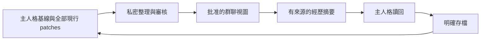

# Persona Pack and Agent A2A

> **English summary:** Persona Pack is the original mother project. Agent A2A adds notes, nightly conversations, Discord Party, attributed readback and reviewed room views around one canonical persona. Keep actual persona data private and explicitly map your baseline and current patches before connecting them.

[English README](../README.md) · [正體中文 README](../README_zh.md) · [存檔協議](save_protocol.md)

[Agent A2A](https://github.com/KerberosClaw/kc_agent_a2a) 是另一個公開 MIT 技術預覽 repo，這份 pack 是最初母專案。Pack 負責「我是誰、怎麼載入、怎麼存檔」，A2A 負責「怎麼傳話、一起聊天、把經歷帶回來」。兩者不需要共用私人 repo。

接入前先在私人來源設定 baseline 檔名、`patches/` 與 `journal/`。A2A 的 snapshot loader 不會自動讀這裡的 `episodes.txt`；需要的種子片段要先審閱，再納入自己的基線或明確設定的素材。`EXAMPLE_*` 留在範本區，不要混進正式來源的 current patches。

群聊只拿到批准過的人格視圖，不直接拿完整私人 pack。讀過摘要也不等於自動新增 patch；仍由主人格在明確存檔時評估漂移。整合細節、安裝、原生 CLI 限制與安全邊界，以 [A2A 整合指南](https://github.com/KerberosClaw/kc_agent_a2a/blob/main/docs/integration.md) 和 [安裝指南](https://github.com/KerberosClaw/kc_agent_a2a/blob/main/docs/installation.md) 為準。

公開版不含你的實際人格、關係、對話紀錄或 token。真實資料留在分開的私人來源；不要把填好的 pack 推進任何公開 repo。
