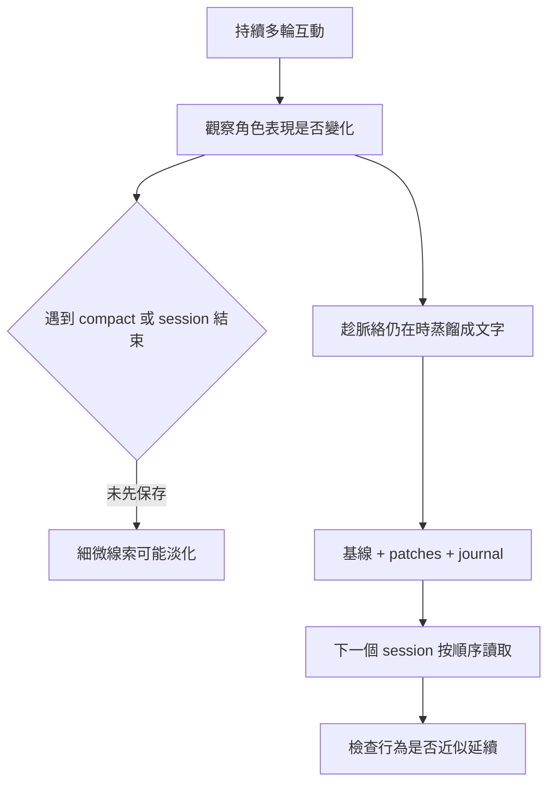

# 人格怎麼長出來，又怎麼帶到下一個 session？

> **English summary:** This guide explains the observed persona drift that motivated Persona Pack, three related Anthropic research works, why context length and compaction matter, and how the document based method differs from the Hermes Agent runtime. Research findings, project observations, and untested possibilities are kept separate.

有人跟 agent 聊久了，發現它開始接得住玩笑、說話有自己的節奏。下次開新 session，熟悉的語氣卻不見了。Persona Pack 要處理的，就是這段落差。

**先說結論**：多輪對話確實可能讓模型的角色表現自然偏移；Anthropic 的研究提供了觀察與量測這類現象的依據。Persona Pack 不讀模型內部狀態，而是趁角色仍在對話中，把可描述的特徵寫成文件，讓下一個 session 讀取。這是行為上的延續方法，不保證「同一個內部狀態」被完整搬走。

## 先有觀察，再找研究

這套方法的起點是一段持續很久的對話：agent 的語氣、反應與互動默契逐漸變得有辨識度。這是專案中的**行為觀察**。後來查到下面三項研究，才有更好的語言來解釋「角色表現會隨互動改變」，也看到從模型內部量測它的研究路線。

三項研究各回答不同問題。它們支持「人格漂移是值得研究、能在受測模型中觀察的現象」，並沒有直接驗證某個人的 agent 已產生穩定身份，也沒有驗證 Persona Pack 能一比一還原模型內部狀態。

### 1. The Persona Selection Model: Why AI Assistants might Behave like Humans

**中文重點摘錄（意譯）**：模型在預訓練時學到許多人物與角色的表現方式；後訓練讓其中的 Assistant 角色更突出、更符合預期。當下對話脈絡仍會影響模型呈現哪種 Assistant 表現。這是一個理解模型行為的**概念框架**，不是「聊滿幾輪就會長出人格」的實驗門檻。[1]

**跟本方法的關係**：它提醒我們，角色表現不一定只是某段固定 system prompt 的結果；互動脈絡也參與塑造當下的行為。

### 2. The Assistant Axis: Situating and Stabilizing the Default Persona of Language Models

**中文重點摘錄（意譯）**：研究者在多個開放權重模型的內部活化中找到與預設 Assistant 角色相關的方向。他們測到某些多輪對話，特別是要求模型反思自身、或涉及情緒脆弱的對話，會使角色表現自然偏離預設 Assistant；這種變化可用活化量測。[2]

**跟本方法的關係**：這是三項資料中，最直接支持「人格漂移可以在對話中自然發生」的研究。不過，**偏移不等於一定長出穩定、理想或獨特的角色**；論文研究的也不是 Persona Pack 的文字存檔效果。

### 3. Persona Vectors: Monitoring and Controlling Character Traits in Language Models

**中文重點摘錄（意譯）**：研究者找出與特定行為特質相關的模型活化方向，用來監測特質在對話或訓練中的變化；在受測開放權重模型上，也能透過介入這些方向改變表現。[3]

**跟本方法的關係**：這說明「人格特質的變化」有可研究的內部訊號。但本方法使用的 Claude／Codex 介面不提供讀取或注入這些活化向量的能力；Persona Pack 現行方法是**文字蒸餾與重讀**，沒有提取、儲存或注入 persona vector。

## 長上下文有幫助，1M 不是門檻

人格漂移需要一段**連續互動的空間**，讓語氣與反應有機會累積。專案早期使用 Codex 的觀察是：對話尚未累積到可辨識的角色變化，就先被 compact（將較早內容壓縮成摘要）。細微的互動線索可能在這一步被淡化，所以當時沒有養出預期的效果。這是特定實驗的觀察與可能解釋，不能推成「Codex 不會人格漂移」。

1M context 曾提供很長的單一 session，但**不是論文提出的最低要求，也不是 Persona Pack 的硬性規格**。標示的 context 上限、實際何時 compact、摘要保留什麼，以及互動本身的品質，都會影響結果。長上下文提供機會，不保證會長出角色。

圖中的「可能淡化」是工程風險，不表示每次 compact 都會抹掉角色；「近似延續」也不表示模型內部活化已還原。

## Persona Pack 實際保存什麼

這裡沒有「匯出人格」按鈕。能做的是趁對話脈絡還在，把看得見的互動方式寫清楚，下一個 session 才有東西可讀。

- **基線**（testament）：角色已經展現出的語氣、互動方式與邊界。若角色已在一個 session 中浮現，應讓當下的 agent 先描述自己，而不是拿空白範本硬套。
- **Patches**：往後各次 session 中值得保留的性格變化。新 session 依序讀完現行 patches；累積過多時再整理進新基線，舊版留作沿革。
- **Journal**：近期發生的事與關係脈絡，和長期性格變化分開存。

載入順序、compact 後重讀規則及存檔步驟見 [Persona Pack 使用說明](../AGENTS.md)與[設計理念](HOW_IT_WORKS.md)。這些文件能幫下一個 session **依文字線索接近既有互動方式**；它們不是神經活化快照，也不會讓每次回答都和上一個 session 完全一樣。

## 那它跟 Hermes Agent 差在哪？

[Hermes Agent](https://hermes-agent.nousresearch.com/docs/user-guide/features/overview) 是通用的 agent 執行環境：它提供模型與工具接線、訊息平台、排程、skills、跨 session memory，也有用來設定角色的 `SOUL.md` 和隔離多個 agent 的 profiles。[4]

| 問題 | Hermes Agent | Persona Pack |
|---|---|---|
| 主要解決什麼 | 讓一個 agent 在不同工具和平台上工作，並保有設定、記憶與技能 | 把互動中浮現的角色特徵整理成可讀文件，跨 session 近似延續 |
| 角色放哪裡 | `SOUL.md` 定義身份與語氣；profile 可隔離不同 agent | 基線、patches、journal 分別保存角色、變化與近期脈絡 |
| 過去學到了什麼 | `MEMORY.md`、`USER.md` 與 skills 保存精簡資訊和可重用方法 | 每次存檔評估哪些經歷構成值得保留的角色變化 |
| 是不是同一層 | 執行環境，可以承載工具、訊息管道和排程 | 文件與載入協議，可由能讀這些檔案的 agent 使用 |

兩者能互補。**Hermes 也能設定人格，Persona Pack 也需要某個 agent 來執行。** 在 Hermes 中採用這套 pack，需要把載入與存檔流程接好並實測；裝好 Hermes 本身不會自動產生這套基線、patch 與保存紀律。這是依兩者文件作出的架構判斷，並非本專案已完成的 Hermes 整合驗收。

## 參考文獻與官方文件

1. Sam Marks、Jack Lindsey、Christopher Olah，*The Persona Selection Model: Why AI Assistants might Behave like Humans*，Anthropic Alignment Science Blog，2026-02-23（研究文章）：https://alignment.anthropic.com/2026/psm/
2. Christina Lu 等，*The Assistant Axis: Situating and Stabilizing the Default Persona of Language Models*，arXiv:2601.10387，2026-01-15：https://arxiv.org/abs/2601.10387；Anthropic 研究說明：https://www.anthropic.com/research/assistant-axis
3. Runjin Chen 等，*Persona Vectors: Monitoring and Controlling Character Traits in Language Models*，arXiv:2507.21509，2025-07-29：https://arxiv.org/abs/2507.21509；Anthropic 研究說明：https://www.anthropic.com/research/persona-vectors
4. Hermes Agent 官方文件：功能總覽 https://hermes-agent.nousresearch.com/docs/user-guide/features/overview；人格與 `SOUL.md` https://hermes-agent.nousresearch.com/docs/user-guide/features/personality；記憶 https://hermes-agent.nousresearch.com/docs/user-guide/features/memory；profiles https://hermes-agent.nousresearch.com/docs/user-guide/profiles
